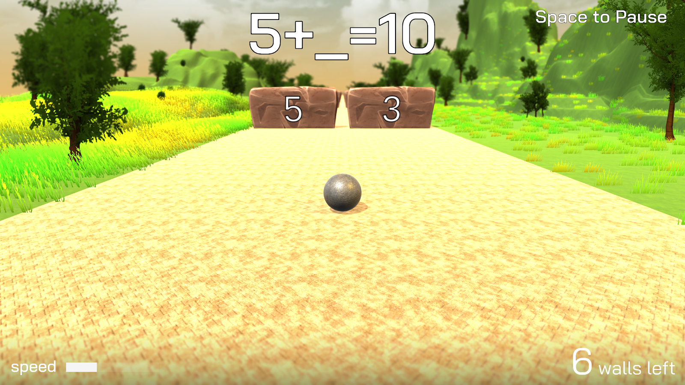

# MathMart3
MathMart3 is the latest in the series of MathMart games. 
* Written in Unity3D.
* Includes Python Django-REST Swagger API to retrieve scores and edit levels. 
* Procfile included for deployment on Heroku.

